# Library database 

Hi everyone, in this project i created a simple application that used to manage book's database of a library using python

this application offers many menu:
<ol>
  <li>View book's data</li>
  <li>Adding a new book into the database</li>
  <li>Removing a book from database</li>
  <li>Updating a book's data</li>
</ol>

To use the menu, user will have to input integer from 1 to 4.

# View book's data

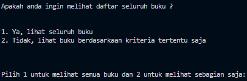

Users can choose whether to see all of the book's data or just books with certain category.

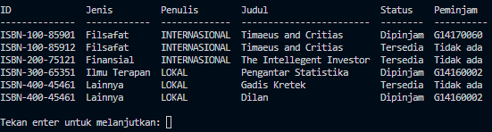

if the users choose to see all of the book, every book in the database will be displayed.

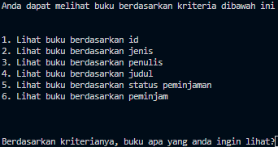

if the users choose to see books with certain category, users will have to input which category that they want to see.

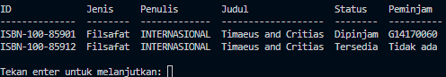

After choosing the category, books with the category will be displayed
# Removing a book from database

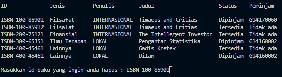

To remove a book from the database, user will have to input the id of the book that will be removed, in this example the book with id ISBN-100-85901 will be removed.

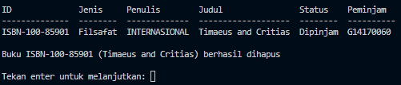

After inputing the book's id, a notification will appear to inform the book with inputed id have been succesfully removed.

# Adding a new book into the database

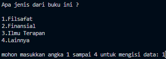

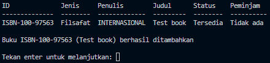

# Updating a book's data

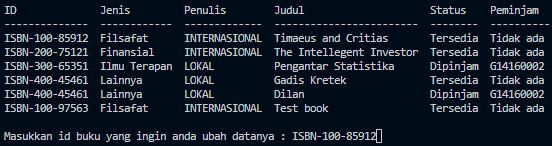

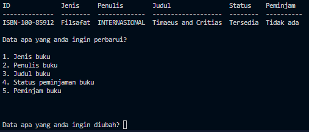

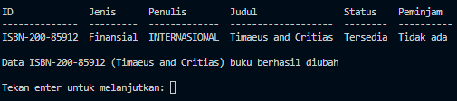

