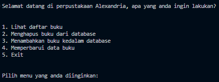

# Library database 

Hi everyone, in this project i create a simple application that used to manage book's database of a library using python

this application offers many menu:
<ol>
  <li>View book's data</li>
  <li>Adding a new book into the database</li>
  <li>Removing a book from database</li>
  <li>Updating a book's data</li>
</ol>

# Menu

# View book's data
# DELETE
# UPDATE
